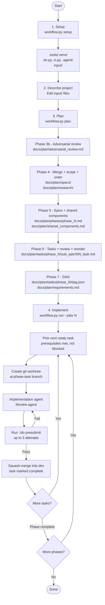

# Workflow Tool

An AI-driven planning and implementation workflow that takes a project description from
idea to a fully-planned, parallel-executed codebase. It has two main phases:

1. **Plan** — multi-phase AI pipeline that produces research documents, specs, requirements,
   epics, tasks, and dependency DAGs.
2. **Run** — parallel implementation loop where AI agents work on tasks concurrently,
   each in an isolated git worktree, with automatic squash-merge into `dev`.

---

## Workflow Overview



---

## Requirements

| Dependency | Purpose |
|---|---|
| Python 3.9+ | Runtime |
| `git` | Worktree and branch management |
| `gemini` CLI (or `claude` / `copilot`) | AI backend |
| `uvx` *(optional)* | Serena MCP integration |

---

## Quick Start

### 1. Describe your project

Add one or more files to `.tools/input/`. Every file in this directory is read and
concatenated (sorted by filename) to form the project context passed to every AI step.
This is the single source of truth for all downstream planning and implementation.

```
.tools/input/
  project-description.md   # main description (required)
  tech-stack.md             # optional — tech constraints, language choices
  existing-api.md           # optional — existing systems to integrate with
  …                         # any other reference material
```

Files are injected with a `## <filename>` header so the AI can distinguish between them.

### 2. Set up the environment

```bash
python .tools/workflow.py setup
```

This creates `.tools/.venv/`, installs dependencies, and copies starter templates
(`.agent/`, `do.py`, `ci.py`) into the project root.

### 3. Run the planning pipeline

```bash
python .tools/workflow.py plan
```

Runs all planning phases in order and produces:

```
docs/plan/
  research/          # Market, competitive, tech landscape, user research
  specs/             # PRD, TAS, security design, UI/UX, roadmap, …
  requirements/      # Per-doc extracted requirements
  phases/            # Implementation epics (phase_1.md, phase_2.md, …)
  tasks/             # Atomic task files, grouped into sub-epics
    phase_1/
      <sub_epic>/
        01_task.md
        02_task.md
        …
      dag.json       # Dependency graph for this phase
    phase_2/
      …
  shared_components.md
requirements.md      # Master requirements list
```

The pipeline is resumable — each phase records its completion state and is
skipped on re-run.

**Re-run a specific phase:**

```bash
python .tools/workflow.py plan --phase 6-tasks --force
```

Phase slugs: `3b-adversarial`, `4-merge`, `4-scope`, `4-order`, `5-epics`,
`5b-components`, `6-tasks`, `6b-review`, `6c-cross-review`, `6d-reorder`, `7-dag`.

**Use a different AI backend:**

```bash
python .tools/workflow.py --backend claude plan
```

Available backends: `gemini` (default), `claude`, `copilot`.

### 4. Implement in parallel

```bash
python .tools/workflow.py run --jobs 4
```

For each ready task (prerequisites met, not blocked):

1. Creates a git worktree on a dedicated branch (`ai-phase-<task>`).
2. Runs the **Implementation** agent, then the **Review** agent.
3. Runs `./do presubmit` (configurable via `--presubmit-cmd`) up to 3 times,
   feeding failures back to the Review agent.
4. Squash-merges the branch into `dev` via a temporary clone.
5. Records the task as completed and pushes `dev`.

Tasks in earlier phases act as a barrier — phase N must fully complete before
phase N+1 begins.

Progress is logged to `.tools/run_workflow.log`. Press **Ctrl-C** once for a
graceful drain (in-flight tasks finish); twice for immediate exit.

---

## Configuration

### `workflow.jsonc`

```jsonc
{
  // Enable Serena MCP server integration for agent code intelligence.
  // When true, workflow seeds each worktree with a Serena cache and rebuilds
  // it after each successful merge so agents have up-to-date code search.
  "serena": false
}
```

Set `"serena": true` to enable [Serena](https://github.com/oraios/serena) code-intelligence
in every task worktree. Requires `uvx` on `PATH`. On first run, the Serena index is
bootstrapped from `dev`; it is refreshed after each successful merge.

### Presubmit command

The `run` command verifies each task with a shell command before merging.
Default: `./do presubmit`. Override with:

```bash
python .tools/workflow.py run --presubmit-cmd "pytest -x"
```

### Agent memory

`.agent/MEMORY.md` in the project root is injected into every implementation
agent's context. Use it to record architectural decisions, naming conventions,
and brittle areas so agents stay consistent across tasks.

---

## Status & Replan Commands

### Check progress

```bash
python .tools/workflow.py status
```

Shows each task with a status icon:

| Icon | Meaning |
|---|---|
| `[x]` | Merged into `dev` |
| `[~]` | Completed, not yet merged |
| `[ ]` | Ready (all prerequisites met) |
| `[.]` | Waiting on prerequisites |
| `[B]` | Blocked |

### Validate plan artefacts

```bash
python .tools/workflow.py validate
```

Runs all `verify_requirements.py` checks (master list, phase coverage, task coverage, DAGs).

### Block / unblock a task

```bash
python .tools/workflow.py block phase_1/api/01_setup.md --reason "API design not finalised"
python .tools/workflow.py unblock phase_1/api/01_setup.md
```

Blocked tasks are skipped by `run` and do not block other tasks' prerequisites.

### Remove a task

```bash
python .tools/workflow.py remove phase_1/api/03_legacy.md
```

Deletes the file, removes it from `dag.json`, and warns about any orphaned requirements.

### Add a new task

```bash
python .tools/workflow.py add phase_1 api --desc "Add rate-limiting middleware"
```

AI-generates a new task file in the specified phase/sub-epic and rebuilds the DAG.

### Modify requirements

```bash
# Open requirements.md in $EDITOR
python .tools/workflow.py modify-req --edit

# Remove a requirement (moves it to a 'Removed' section)
python .tools/workflow.py modify-req --remove AUTH-005

# Add a requirement interactively
python .tools/workflow.py modify-req --add "New feature description"
```

### Regenerate a DAG

```bash
python .tools/workflow.py regen-dag phase_1
```

Rebuilds `dag.json` for a phase — programmatically from task `depends_on` metadata
when available, AI-generated otherwise.

### Regenerate tasks

```bash
python .tools/workflow.py regen-tasks phase_1 --sub-epic api
```

Clears and regenerates task files for a sub-epic, then rebuilds the DAG.

### Regenerate shared components

```bash
python .tools/workflow.py regen-components
```

### Cascade after manual edits

After editing task files by hand:

```bash
python .tools/workflow.py cascade phase_1
```

Rescans tasks, checks requirement coverage, rebuilds the DAG, and validates.

---

## Directory Structure

```
.tools/
  workflow.py          # Entry point (delegates to workflow_lib/)
  workflow.jsonc       # Configuration (serena toggle, etc.)
  workflow_lib/        # Core library
    cli.py             # Argument parser + command dispatch
    orchestrator.py    # Planning phase sequencer
    phases.py          # Phase implementations (Phase1 … Phase7B)
    executor.py        # Parallel DAG execution engine
    replan.py          # Mid-run replan commands
    context.py         # Shared project context + AI runner wrapper
    runners.py         # AI backend adapters (Gemini, Claude, Copilot)
    state.py           # Workflow + replan state persistence
    config.py          # workflow.jsonc loader
    constants.py       # Paths + document catalogue
  prompts/             # Prompt templates for every AI step
  input/
    project-description.md   # ← Edit this first
  templates/
    .agent/MEMORY.md   # Agent memory template
    do.py              # Presubmit / build script template
    ci.py              # CI script template
    .mcp.json          # Serena MCP server config template
  tests/               # pytest test suite
  requirements.txt     # Python dependencies (pytest, coverage, mypy)
```

---

## Development

### Run tests

```bash
cd .tools
.venv/bin/python -m pytest tests/ -v
```

### Run with coverage

```bash
.venv/bin/python -m pytest tests/ --cov=workflow_lib --cov-report=term-missing
```

### Type checking

```bash
.venv/bin/python -m mypy workflow_lib/ --ignore-missing-imports
```

Or via the test suite:

```bash
.venv/bin/python -m pytest tests/test_mypy.py -v
```

---

## Troubleshooting

**Planning stopped mid-run** — re-run `python .tools/workflow.py plan`. Completed phases
are skipped automatically. Use `--phase <slug> --force` to re-run a specific phase.

**A task is stuck in a worktree** — the worktree is left on disk on failure for inspection.
Clean up with:

```bash
python .tools/clean-worktrees.py
```

**DAG deadlock during `run`** — use `python .tools/workflow.py status` to see which tasks
are waiting. Check for a cycle in the DAG or a blocked prerequisite, then use
`block`, `remove`, or `regen-dag` to resolve it.

**Scope creep in requirements** — run `python .tools/workflow.py validate` and review
`docs/plan/adversarial_review.md`. Use `modify-req --remove` to prune requirements,
then `cascade` to rebuild affected DAGs.
